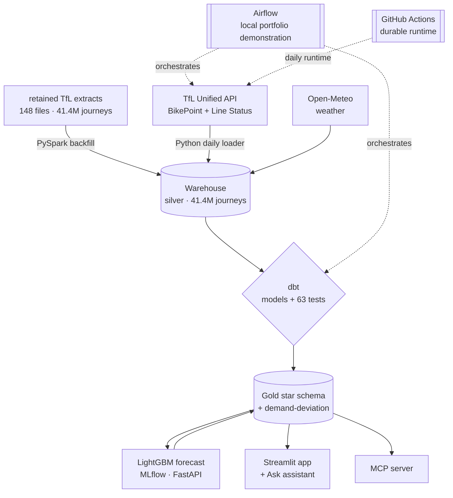

# London cycle-hire analytics

This project measures what happens to London's cycle-hire demand when the wider transport network
is disrupted. It combines a PySpark historical backfill, a daily live-data job, a LightGBM demand
model and a Streamlit app. The hosted workflow uses free GitHub Actions, stores outputs as committed
Parquet and queries them through DuckDB, so there is no live warehouse to maintain.

[](https://github.com/rosscyking1115/tfl-data-engineering/actions/workflows/ci.yml)
[](LICENSE)
[](https://tfl-data-engineering.streamlit.app/)

**[Live demo](https://tfl-data-engineering.streamlit.app/)** · [Engineering notes](docs/) · [Architecture](#architecture)

## Analyst investigation

**Decision supported:** assess whether a verified, source-cited London Underground strike is
associated with a material change in cycle-hire demand before treating disruption as an explanatory
factor in analyst investigation. The locked ADR-0009 result is **an observed association, not
causation**: the certified evidence reports 1.42× median station-day demand relative to its
weather-adjusted expectation, with its existing uncertainty checks. See the
[certified-evidence note](docs/certified_evidence.md) for source-to-consumer lineage.

The workflow deliberately has two horizons: cited strikes support historical measurement; Line
Status and BikePoint snapshots are forward-collected live monitoring. **GitHub Actions + committed
Parquet/DuckDB** is the durable runtime. **Airflow is a local portfolio demonstration**, not the
production scheduler.

> This is one of three UK open-data projects on my profile. The other two are
> [england-wales-housing-decision-support](https://github.com/rosscyking1115/england-wales-housing-decision-support)
> (analytics engineering: Dagster, a fully tested dbt project, published dbt docs) and
> [community-energy-flex](https://github.com/rosscyking1115/community-energy-flex) (a decision
> system with LP/MILP optimisation and a forecast-versus-actual review). See
> [my GitHub profile](https://github.com/rosscyking1115) for the full project map.


> [!NOTE]
> The live demo is on Streamlit's free tier and may take ~30s to wake on the first visit.
> Journey data is published in bulk with a ~1–2 month lag. The workflow therefore keeps
> **historical measurement** separate from **live monitoring** and does not claim real-time
> trip prediction ([ADR-0006](docs/adr/ADR-0006-pivot-to-live-disruption-workflow.md)).

## Overview

Transport for London has published cycle-hire journeys since 2012. A historical bucket inventory
recorded roughly **189M trips across 482 objects**; that is a dated inventory snapshot, not a claim
about the current bucket. The implemented backfill covers **41.4M journeys in 148 retained files
from 2022 to May 2026**, including five ordered-header variants.

- **Disruption analysis:** a weather-adjusted baseline that measures how Tube and rail strikes
  reshape cycling demand, per station and per day.
- **Demand forecast:** a LightGBM model that predicts station-level demand and improves the
  "normal" baseline the disruption effect is measured against.
- **Daily live layer:** a GitHub Actions job that refreshes line status and dock
  occupancy into committed Parquet, so the app keeps running with no warehouse and no server.

Full-network strike days reached **~2.3× normal cycling demand**. Across 13 source-cited events,
the median was **1.42×** a weather-adjusted baseline.

## What is implemented

- **Backfill and reconciliation.** PySpark unifies **41.4M journeys (2022–May 2026)** across five
  ordered-header variants. Columns were renamed, dropped and reordered between eras. Every file
  reconciles raw rows to silver rows plus quarantine
  ([captured warehouse evidence](docs/snowflake_evidence.md)).
- **Spark/Python boundary.** Spark handles the multi-era backfill; plain Python handles the
  kilobyte-sized daily API pulls. The boundary is documented in
  [the Spark ↔ Python boundary](#the-sparkpython-boundary).
- **Disruption estimate.** A weather-adjusted baseline measures the strike
  effect: disruption days run **1.42× median** demand (**95% CI 1.24–1.61**, bootstrap over 13
  source-cited events), **placebo-tested** (p < 0.001 versus random date sets) and stable across a
  sensitivity battery ([ADR-0009](docs/adr/ADR-0009-analytical-contract.md)).
- **Forecast baseline.** A LightGBM model predicts station-level daily demand. Running it with the
  disruption flag off supplies a counterfactual "normal" baseline
  that's ~30% tighter than the median it replaces (**~21% lower error** on held-out 2026), tracked
  in MLflow ([ADR-0008](docs/adr/ADR-0008-ml-demand-forecast.md)).
- **Read-only questions.** The "Ask the data" page has preset **Quick answers** with no API key;
  every figure comes directly from a query. It also has an
  optional bring-your-own-key Claude chat over curated, read-only tools
  ([ADR-0007](docs/adr/ADR-0007-qa-assistant-tool-calling.md)).
- **Free daily runtime.** A GitHub Actions job refreshes live line status and dock
  occupancy into committed Parquet. The app reads it through DuckDB, so it keeps
  running long after the Snowflake trial ends.
- **Tested dimensional model.** A dbt star schema has **63 data
  tests** (schema, freshness tripwire, temporal coverage, reconciliation, a de-dup unit test)
  plus a **93-test pytest suite** — pipeline guards (idempotency, injected errors, an ML
  leakage guard) and the reliability-reference conformance checks. The full DAG
  runs on both Snowflake (the documented build) and DuckDB. The rebuild **reconciles exactly**
  ([ADR-0010](docs/adr/ADR-0010-migration-retrospective.md)).

## App views

| Demand forecast | Ask the data |
|---|---|
|  |  |

The **Demand forecast** page shows predicted vs actual with the lift over the median baseline; the
**Ask the data** page answers plain-English questions with no key required.

## Architecture



Medallion layers: **bronze** (files/JSON as landed) → **silver** (typed, deduped, era-unified) →
**gold** (tested star schema + analytical models + the model baseline).

## The Spark/Python boundary

Spark handles the backfill because the historical archive is large and its headers changed across
eras. Spark's positional CSV reader would misread reordered columns without per-variant, by-name
projection. The daily BikePoint and Line Status payloads contain only a few hundred rows, so about
150 lines of `requests` and `executemany` are enough. See
[ADR-0002](docs/adr/ADR-0002-spark-in-docker-and-header-variants.md).

## Machine learning

A LightGBM model ([`ml/`](ml/)) learns daily station-level departures from calendar, weather,
disruption and recent-demand lag features. It is used in two ways:

- **A sharper baseline.** Predicting with the disruption flag off yields a counterfactual "normal
  demand" that replaces the coarse median in the deviation analysis (`demand_deviation_ml`).
- **A validated forecast.** Trained with strict temporal validation (fit 2022→24, held-out 2026),
  it cuts error **~21% vs the median** and **~28% vs a seasonal-naive** baseline; runs are tracked
  in MLflow and it's served locally via FastAPI. See
  [ADR-0008](docs/adr/ADR-0008-ml-demand-forecast.md).

```bash
.venv/Scripts/pip install -r ml/requirements.txt
python ml/train.py        # LightGBM + MLflow tracking (local SQLite store)
python ml/predict.py      # -> app/gold_export/predicted_demand.parquet
uvicorn serve:app --app-dir ml --port 8000   # local /predict endpoint
```

## The assistant

The "Ask the data" page only answers questions supported by its tools. It never invents a
figure ([ADR-0007](docs/adr/ADR-0007-qa-assistant-tool-calling.md)):

- **Quick answers:** preset questions answered directly from the gold layer with **no API call**,
  so every number is exactly what the query returned (busiest stations, the strike effect, demand
  trend, and a live "why is this line disrupted now?"). Free for every visitor.
- **Ask anything:** an optional free-form Claude chat that calls the *same* curated, read-only
  tools and reports only numbers a tool produced. It runs on a **bring-your-own-key** basis, so the
  owner's Anthropic credits are never spent by anonymous visitors.

A separate read-only **MCP server** ([`mcp/`](mcp/)) exposes the same gold layer to AI clients
through typed tools. It reads committed Parquet through DuckDB, so it needs no
warehouse or credentials ([ADR-0004](docs/adr/ADR-0004-mcp-readonly-boundary.md)).

## Tech stack

| Layer | Tool |
|---|---|
| Batch processing | PySpark (Dockerised) |
| Warehouse | Snowflake (build) → DuckDB + Parquet (durable, free) |
| Transformation & tests | dbt |
| Machine learning | LightGBM · MLflow · scikit-learn · FastAPI |
| Orchestration | GitHub Actions (durable) · Airflow (local portfolio demonstration) |
| App & AI access | Streamlit · Anthropic SDK · Model Context Protocol |
| Enrichment | TfL Unified API · Open-Meteo |

## Quickstart

```bash
python -m venv .venv
.venv/Scripts/pip install -r app/requirements.txt   # demo app deps
streamlit run app/streamlit_app.py                   # runs on committed Parquet, no warehouse
```

The demo app reads committed Parquet through DuckDB. It needs no database and runs fully offline. The
Quick answers work with no setup; the free-form chat needs your own `ANTHROPIC_API_KEY` (in `.env`
locally). To reproduce the warehouse build (Spark → Snowflake → dbt), see [docs/](docs/).

## Project structure

```
ingestion/   API loaders, warehouse loaders, data-export scripts
spark/       multi-era backfill job
dbt/         staging + marts models, tests, seeds
ml/          demand model: features, LightGBM training (MLflow), batch predict, FastAPI serving
app/         Streamlit app (DuckDB over committed gold Parquet) + Ask assistant
mcp/         read-only MCP server over the gold layer
benchmark/   constructed reliability-reference fixtures and cross-engine conformance suite
infra/       Airflow (Docker Compose), run scripts, bounded Databricks proof candidate
tests/       pytest suite (feature-leakage guard, Quick answers, tool dispatch), run in CI
docs/        ADRs, architecture and engineering notes
```

## How it stays live

A daily GitHub Actions job ([.github/workflows/daily.yml](.github/workflows/daily.yml)) snapshots
live line status and dock occupancy, ingests newly published journey CSVs
([`journey_increment.py`](ingestion/journey_increment.py), which is schema-gated and idempotent), rebuilds
the analytics layer with **dbt tests gating delivery**, and appends a run-metadata audit row. A
red run auto-opens a GitHub issue. The app's **Pipeline health** page shows coverage, freshness
and the audit trail, including gaps. It needs no warehouse or persistent server and runs on free
tiers indefinitely. A second scheduled job
([.github/workflows/keepalive.yml](.github/workflows/keepalive.yml)) pings the app every few hours
so visitors are less likely to encounter a cold start. This works around
free tier, not a Streamlit limit.

The local Airflow portfolio implementation keeps its alert boundary equally
explicit: the daily-ingest, dbt-gate and archive-drift DAGs share a failure
callback that always records a critical task-log event. A webhook is opt-in
through a local environment variable and is not exercised by this project.


## Reliability reference

The separate [portable reliability reference](benchmark/reliability_reference/README.md) uses
constructed fixtures and a reviewed JSON oracle to prove replay, replacement, complete-object
rejection, and interruption recovery across DuckDB and digest-pinned Spark. It does not import
application state or alter the living workflow.

T3 attempted a bounded Databricks Delta proof. The gate ended **NARROW** because the initial
deployment and one allowed corrective deployment could not reliably read workspace Python files.
The semantic oracle was never reached. Teardown was independently verified, no managed
conformance claim is made, and DuckDB/Spark `0.2.0` remains the supported suite.

[Download reliability reference v0.2.0](https://github.com/rosscyking1115/tfl-data-engineering/releases/tag/v0.2.0)

[](docs/reliability-reference/releases/0.3.0/README.md)

[](docs/reliability-reference/releases/0.3.0/README.md)

## Engineering notes

- [ADR-0001](docs/adr/ADR-0001-dataset-and-stack.md): dataset selection, with measured evidence
- [ADR-0002](docs/adr/ADR-0002-spark-in-docker-and-header-variants.md): Spark environment and schema-drift handling
- [ADR-0003](docs/adr/ADR-0003-orchestration-and-boundary.md): orchestration sizing and the incremental boundary
- [ADR-0004](docs/adr/ADR-0004-mcp-readonly-boundary.md): MCP read-only controls
- [ADR-0005](docs/adr/ADR-0005-streamlit-demo-layer.md): the demo layer and durable hosting
- [ADR-0006](docs/adr/ADR-0006-pivot-to-live-disruption-workflow.md): the live workflow and the journey-lag boundary
- [ADR-0007](docs/adr/ADR-0007-qa-assistant-tool-calling.md): curated tool-calling, public preset answers and BYOK chat
- [ADR-0008](docs/adr/ADR-0008-ml-demand-forecast.md): LightGBM counterfactual baseline with temporal validation
- [ADR-0009](docs/adr/ADR-0009-analytical-contract.md): claim, design, assumptions, falsifiers and correction log
- [ADR-0010](docs/adr/ADR-0010-migration-retrospective.md): the completed Snowflake-to-DuckDB migration
- [ADR-0011](docs/adr/ADR-0011-reliability-reference-extension.md): licence-bounded reliability-reference extension
- [Portable reliability reference](benchmark/reliability_reference/README.md): recovery protocol, constructed fixtures and DuckDB/Spark parity
- [Source contracts](docs/source_contracts.md): upstream dependencies and failure signals
- [Snowflake evidence](docs/snowflake_evidence.md): captured warehouse figures and cost

## Limitations

- **Associational, not causal.** The 1.42× effect is an observed association against a
  weather-adjusted baseline with stated assumptions. Strikes are announced, seasonal, and
  weather-entangled, so causal identification is out of scope
  ([ADR-0009](docs/adr/ADR-0009-analytical-contract.md)).
- **Two data horizons.** Deep event history exists only for *strikes* (publicly documented,
  source-cited); the API-derived log of all disruption types accumulates forward from
  2026-07-08 only. Line-level proximity analysis activates once journey extracts cover that
  window.
- **Journey data lags ~1–2 months** because of TfL's bulk publishing schedule. Live monitoring and
  historical measurement are separate claims.
- **Missed snapshot days are permanent.** The API keeps no history; 2026-07-11/12 were lost to
  a since-fixed crash and are shown as holes on the Pipeline health page, not hidden.
- **Increment approximation:** arrivals on extract-boundary dates can miss rides that started
  in the previous file. Departures, the demand measure used here, are exact.
- **GitHub Actions cron is best-effort** and the free Streamlit tier sleeps; both are accepted,
  documented trade-offs of the zero-cost runtime.

## Attribution

**Powered by TfL Open Data.** Contains OS data © Crown copyright and database rights 2016 and
Geomni UK Map data © and database rights 2019. Weather by [Open-Meteo](https://open-meteo.com/)
(CC-BY 4.0).

## Roadmap

- **Power BI (PL-300):** a code-first semantic model over the same durable Parquet lives in
  [`powerbi/`](powerbi/), with DAX measures, Power Query M and a TMDL model ready to assemble into a
  report in Power BI Desktop.
- Accumulate forward dock-occupancy history to unlock short-horizon availability nowcasting
  (TfL does not publish historical occupancy).
- Extend the forecast to an hourly grain (needs a pre-trial Snowflake re-export of hourly flows).
- Optional always-on hosting (a small paid host) to remove free-tier cold starts entirely.
