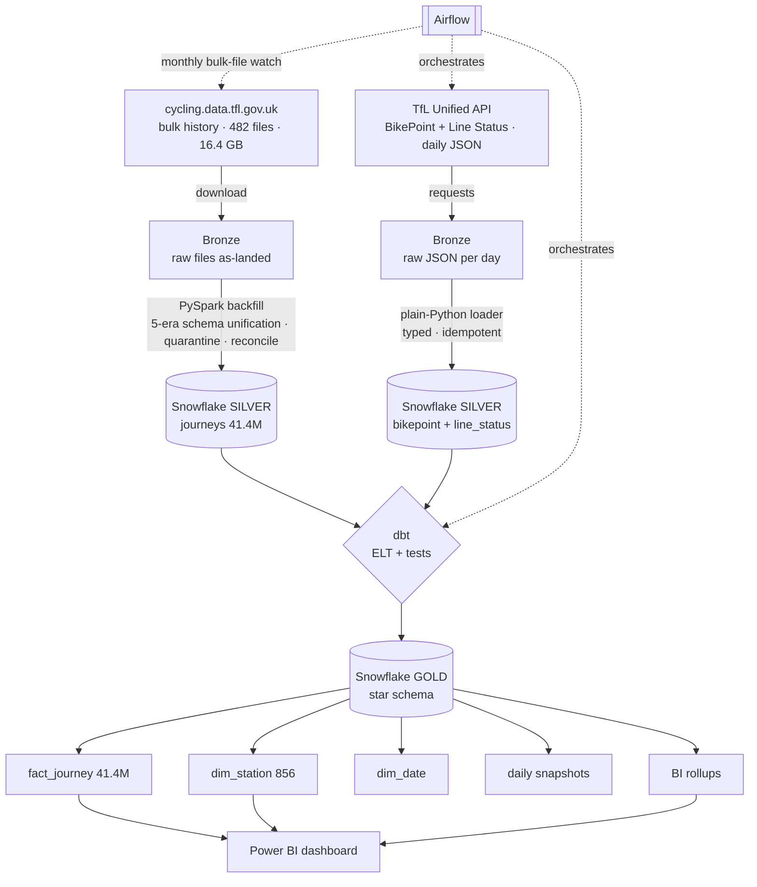

# TfL Cycle-Hire Data Pipeline

An end-to-end data pipeline over the **full Santander Cycle Hire journey archive** — a
genuinely messy, decade-spanning public dataset. It backfills ten years of
schema-drifting bulk files with **PySpark**, lands them in a **Snowflake** medallion
warehouse, shapes and tests a star schema with **dbt**, runs a daily incremental layer
off the **TfL Unified API** under **Airflow**, and serves a **Power BI** dashboard on the
gold layer.

The point of the project is not that it uses those tools — it's that each tool is used
**only where the data justifies it, with the reasoning written down**. The single most
important artifact here is the [Spark ↔ plain-Python honesty boundary](#the-honesty-boundary-spark-vs-plain-python):
Spark for the 189M-row multi-era backfill, plain Python for the kilobyte daily pulls,
and a clear argument for why using Spark for the latter would be theatre.

> Built as a focused, time-boxed skill project (Gate 0 + four phases). Every phase ends
> in a runnable state; every non-obvious decision is an [ADR](docs/adr/).

## Live demo

**▶ [Explore the interactive dashboard](https://share.streamlit.io/)** *(deploy link — see
[app/](app/))* — a zero-setup Streamlit app over the gold layer: system-wide usage trends
(the Sep-2022 schema-era switch is visible in the time series) and a per-station explorer.
It reads committed Parquet via DuckDB, so it runs with **no live warehouse** and outlives
the Snowflake trial.

<!-- After deploying to Streamlit Community Cloud, replace the link above with the app URL
     and drop a screenshot at docs/img/streamlit_demo.png, then uncomment: -->
<!--  -->

## At a glance

| | |
|---|---|
| **Source dataset** | Santander Cycle Hire journeys — 482 files, 16.4 GB, 2012 → May 2026, **~189M rows** (extrapolated from measured samples, [Gate 0](docs/gate0/cycle_gate0_findings.md)) |
| **Backfilled slice** | 2022 → 2026: 148 files, 6.5 GB raw → **41,376,181 rows** in Snowflake, reconciled per-file to zero delta |
| **The mess (real)** | 5 distinct CSV header variants — a column deleted mid-2022, two column-order shuffles in 2025, a whole ID-space change, `dd/MM/yyyy` → ISO timestamps |
| **Warehouse cost** | **≈0.50 credits (~$1)** for the *entire* build on the $400 trial — XS warehouse, 60 s auto-suspend |
| **Tested models** | 8 dbt models, **48 tests, all green**, run inside the orchestrator daily |
| **Orchestration** | Airflow: daily API ingest → dbt build+test, monthly bulk-file watch, demonstrated failure alerting |
| **Stack** | PySpark · Snowflake · dbt · Airflow · Power BI · Docker |

## Architecture



Medallion layers: **bronze** = files/JSON exactly as landed (immutable); **silver** =
clean, typed, deduped, unified across eras; **gold** = tested star schema for BI.

## The honesty boundary: Spark vs plain Python

This is the interview centerpiece — the same reasoning that **demands** Spark for one job
**forbids** it for the other.

**Spark for the backfill — justified.** Unifying a decade of the bulk archive is
genuinely awkward on a single machine at full grain: ~189M rows across 482 files with
**five distinct schema layouts** that Spark's positional CSV reader would silently
corrupt if read naively. The job groups files by exact header, projects each to a unified
schema **by column name** (not position), tries every observed timestamp format,
quarantines bad records with reasons, and emits a **per-file reconciliation audit** so
`raw = silver + quarantine` is proven, not hoped. Details:
[ADR-0002](docs/adr/ADR-0002-spark-in-docker-and-header-variants.md),
[Phase 1 findings](docs/phase1/backfill_findings.md).

**Plain Python for the daily increments — justified.** A day of BikePoint + Line Status
JSON is ~800 dock rows and ~20 line rows — **kilobytes**.
[`daily_api_ingest.py`](ingestion/daily_api_ingest.py) is ~150 lines of `requests` +
`executemany`: it lands raw JSON as bronze, enforces ingestion quality gates (a partial
API response fails loudly rather than loading a half-empty snapshot), and loads Snowflake
idempotently (delete+insert per snapshot date). Spinning up Spark for this would add a
JVM, a cluster abstraction, and serialization overhead to move a few kilobytes — pure
theatre.

**Why not DuckDB/BigQuery for the whole thing?** At this data size, honestly, a single
DuckDB process could do the backfill too, and would be the right *production* call for a
one-analyst workload. Snowflake and Spark are here to **build and demonstrate
warehouse/distributed fluency** on a dataset big and messy enough to make that fluency
legible — not because 41M rows *require* a warehouse. Stating that plainly is the point;
claiming false necessity is what the project is built to avoid.

## The data was authentically messy (the cleaning story)

Gate 0 verified the mess firsthand before a line of pipeline was written. What the
backfill actually had to absorb:

- **A schema-era switch mid-dataset.** `Rental Id, Duration (s), … , dd/MM/yyyy HH:mm`
  (2012→Sep 2022) became `Number, …, Bike model, Total duration (ms), ISO timestamps`
  (Sep 2022→now) — different column names, count, order, units, and datetime format.
- **Five header variants, not two.** Beyond the two eras: one 2022 file is **missing the
  `EndStation Id` column entirely**, and two 2025 layouts **shuffle station name/number
  order**. Positional reading corrupts 11 of 111 recent files; name-based projection
  survives.
- **An entire station-ID regime change.** Classic integer IDs (`197`) vs next-gen
  zero-padded terminal codes in new ranges (`001211`, `300050`) — the **same physical
  docks** in disjoint ID spaces. `dim_station` conforms them by cleaned station **name**,
  which is the only key present in every era *and* in the 312k rows that lost their
  end-station ID — repairing all of them.

Result of the 2022→2026 run: **41,376,421 raw → 41,376,181 silver + 240 quarantine**,
per-file delta **0 everywhere**. The 240 quarantined rows are broken hires that never
docked (non-positive duration). Zero duplicate rental IDs in-window.

## Star schema + tests

`dbt build` produces a Kimball star in `TFL.GOLD` and runs **48 tests, all green** — the
same suite Airflow runs daily.

| model | grain | rows |
|---|---|---:|
| `fact_journey` | one hire | 41,376,181 |
| `dim_station` | one station (both ID regimes conformed by name) | 856 |
| `dim_date` | one day | 2,588 |
| `bikepoint_daily_snapshot` | dock × day | ~800/day |
| `line_status_daily` | line × status × day | ~20/day |
| `daily_journey_stats`, `station_daily_flows` | BI rollups (import-friendly) | 1.6k / 1.28M |

Test contract: surrogate-key uniqueness + `not_null`; `(era, rental_id)` unique
combination; accepted ranges (`duration_s ≥ 1`, dates in window); referential integrity
`fact → dim_station` (both ends) and `fact → dim_date`; `accepted_values` on era and
transport mode. See [Phase 2 findings](docs/phase2/dbt_findings.md).

Sanity through the star: Hyde Park Corner is the all-time top departure station (287k),
matching TfL's published rankings; weekend rides run ~30% longer than weekday in both
eras — the expected leisure-vs-commute signal.

## Orchestration

Airflow 2.11 **standalone** in Docker Compose — scheduler + webserver + metadata DB in
one container. Deliberately *not* a Celery/Postgres fleet: three small DAGs for a
single-user pipeline don't need it (the same sizing honesty as the Spark decision, applied
to orchestration). dbt runs from an **isolated venv inside the image** because dbt-core and
Airflow conflict on shared dependencies.

| DAG | schedule | role |
|---|---|---|
| `daily_api_ingest` | 05:30 | pull API snapshots → trigger dbt |
| `dbt_build_and_test` | triggered + 07:00 safety net | full `dbt build` (models + all tests) |
| `monthly_history_check` | monthly | re-list the bulk bucket; **fail loudly** if new journey files appear |
| `failure_alert_demo` | manual | proves the alert path |

**Failure alerting is demonstrated, not just wired:** a shared `on_failure_callback`
emits a CRITICAL alert with full DAG/task context (and POSTs a Slack-compatible webhook
when `ALERT_WEBHOOK_URL` is set). The demo DAG was triggered, failed by design, and the
alert fired — [verified in the Phase 3 findings](docs/phase3/airflow_findings.md).

## Cost story (Snowflake)

30-day / $400 trial, **Standard** edition, AWS eu-west-2, **XS** warehouse, **60 s
auto-suspend** on every warehouse. Priced at Standard's ~$2/credit:

| date | phase | credits | ~$ |
|---|---|---:|---:|
| 2026-07-07 | Phase 1b — stage + COPY of 41.4M-row silver (1.6 GB) | 0.105 | $0.21 |
| 2026-07-07 | Phase 2 — dbt build (4 models, 28 tests) + sanity queries | 0.11 | $0.22 |
| 2026-07-08 | Phase 3 — daily loads + 2× dbt build (8 models, 48 tests) via Airflow | 0.15 | $0.30 |
| | **Total measured** (0.485 compute + 0.012 cloud services) | **≈0.50** | **≈$1** |

**The whole build cost about a dollar.** The tuning that made it so: XS warehouse (never
larger — nothing here is CPU-bound at the warehouse), aggressive 60 s auto-suspend so the
warehouse is almost never billing idle, dbt `table` materializations built in one pass
rather than re-queried, and Power BI pointed at **rollup tables** (1.6k / 1.28M rows) so
dashboard slicers never scan the 41M-row fact. Storage is a rounding error — 1.6 GB of
parquet compresses further in Snowflake.

## Limitations & what I'd change under real concurrency

Honest boundaries of this build, and how it would change if it were a production system
with many concurrent users instead of a portfolio slice:

- **Backfill window is 2022→2026 (~41M), not the full ~189M.** Extending is a config
  change (widen the download window) — deliberately time-boxed, not a technical wall. The
  full-history run belongs on serverless Spark, not a laptop.
- **Warehouse sizing assumes one analyst.** Under real BI concurrency I'd move gold to a
  **multi-cluster** warehouse (auto-scale out for query concurrency, not up), and likely
  add **clustering keys** on `fact_journey(start_date_key)` since nearly every query is
  date-filtered.
- **`dim_station` conforms by cleaned name** — robust here (856 stable stations) but
  name-fuzziness would eventually need a curated crosswalk/SCD-2 rather than a string join.
- **Full-refresh `table` materializations** are fine at 41M rows and one-a-day cadence;
  at production volume/frequency, `fact_journey` becomes an **incremental** model keyed on
  `(era, rental_id)` so each run appends the new window instead of rebuilding.
- **Airflow standalone + SQLite** is single-node by design. Production = LocalExecutor/
  Celery on Postgres, secrets in a real backend (not `.env`), and the failure webhook
  wired to an actual on-call channel.
- **Orchestration is idempotent but not backfill-parallel** — the daily loader's
  delete+insert-per-date makes reruns safe, which is the property that matters most.

## Phase 5 (bonus): read-only MCP layer

A small [MCP](https://modelcontextprotocol.io) server ([`mcp/gold_server.py`](mcp/gold_server.py))
exposes the gold layer to an AI client so it can answer questions like *"which stations were
busiest in 2024?"* through **typed tools instead of guessed SQL**. Framed honestly as an
AI-integration *demonstration on top of* the pipeline — not pipeline machinery (Airflow
orchestrates the pipeline; the AI does not).

Three independent guardrails ([ADR-0004](docs/adr/ADR-0004-mcp-readonly-boundary.md)):
1. **Least-privilege role** `TFL_GOLD_READONLY` — SELECT on `TFL.GOLD` only; no writes, no
   SILVER/RAW. The guardrail is enforced by Snowflake, not app code.
2. **`use secondary roles none`** on every connection — without it the trial account's default
   secondary roles leak ACCOUNTADMIN back in (verification caught exactly this: INSERT and
   SILVER-SELECT wrongly succeeded until it was added).
3. **Curated, parameterized tools only** — `search_stations`, `top_stations`,
   `daily_usage_trend`, `station_flow`. No free-form `run_sql` escape hatch.

Registered in [`.mcp.json`](.mcp.json); run `mcp/setup_readonly_role.sql` once first.

## Repo layout

```
ingestion/   Gate 0 verification scripts · daily API loader · Snowflake loader
spark/       backfill.py — the multi-era unification job
dbt/         staging + marts models, tests, profiles (creds via env_var)
infra/       docker-compose · Airflow image + DAGs · run_dbt.ps1 · run_backfill.ps1
mcp/         read-only MCP server over gold + role-setup SQL (Phase 5 bonus)
app/         Streamlit demo (DuckDB over committed gold Parquet) — the public "show" layer
docs/        ADRs · Gate 0 evidence · per-phase findings · Power BI guide
data/        local bronze zone (gitignored)
```

## Run it yourself

Prerequisites: Python 3.13 venv, Docker Desktop, a Snowflake account, a (free) TfL API
key. Secrets go in `.env` (see [`.env.example`](.env.example)) — never committed.

```powershell
# 1. env + deps
python -m venv .venv
.venv\Scripts\pip install requests duckdb pandas openpyxl pyspark snowflake-connector-python dbt-snowflake python-dotenv
copy .env.example .env    # fill in Snowflake + TfL keys

# 2. verify the dataset (Gate 0) and download the backfill window
.venv\Scripts\python ingestion\gate0_cycle_inventory.py
.venv\Scripts\python ingestion\download_backfill_files.py

# 3. Spark backfill → parquet silver (runs in the official Spark container)
.\infra\run_backfill.ps1

# 4. load silver to Snowflake, then build+test the star schema
.venv\Scripts\python ingestion\load_silver_to_snowflake.py
.\infra\run_dbt.ps1 build

# 5. orchestrate: Airflow at http://localhost:8080
docker compose -f infra\docker-compose.yml up -d
```

Power BI connection + suggested visuals: [docs/phase3/powerbi_guide.md](docs/phase3/powerbi_guide.md).

## Decision record

- [ADR-0001](docs/adr/ADR-0001-dataset-and-stack.md) — why cycle-hire over LAQN, with measured numbers
- [ADR-0002](docs/adr/ADR-0002-spark-in-docker-and-header-variants.md) — Spark-in-Docker, and header-variant grouping
- [ADR-0003](docs/adr/ADR-0003-orchestration-and-boundary.md) — Airflow sizing + the incremental-layer boundary
- [ADR-0004](docs/adr/ADR-0004-mcp-readonly-boundary.md) — MCP read-only role + curated-tools boundary
- [ADR-0005](docs/adr/ADR-0005-streamlit-demo-layer.md) — Streamlit demo as the public consuming layer (DuckDB/Parquet, trial-independent)

## Build status

- [x] Gate 0 — dataset verified and locked
- [x] Phase 1 — Spark backfill → Snowflake silver (41.4M rows, reconciled)
- [x] Phase 2 — dbt star schema, 28 → 48 tests green
- [x] Phase 3a — Airflow live, daily ingest → dbt chain, failure alert demonstrated
- [ ] Phase 3b — Power BI dashboard (guide ready; hand-built in Power BI Desktop)
- [x] Phase 4 — this README
- [x] Phase 5 (bonus) — read-only MCP layer over gold, verified read-only
- [x] Streamlit demo — interactive public dashboard over gold (verified locally; deploy = one click)
