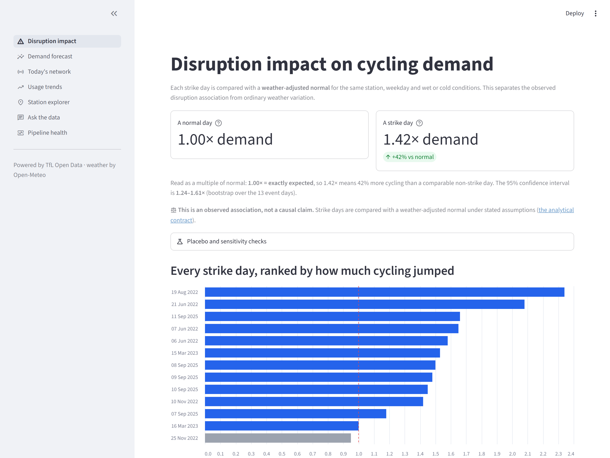
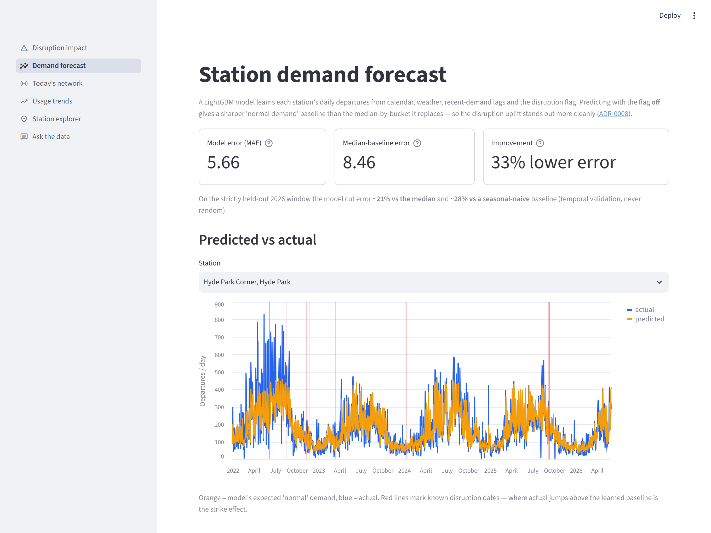
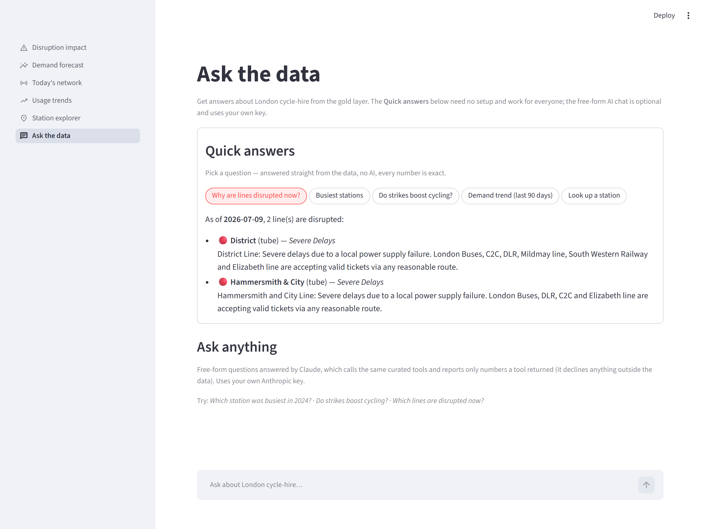
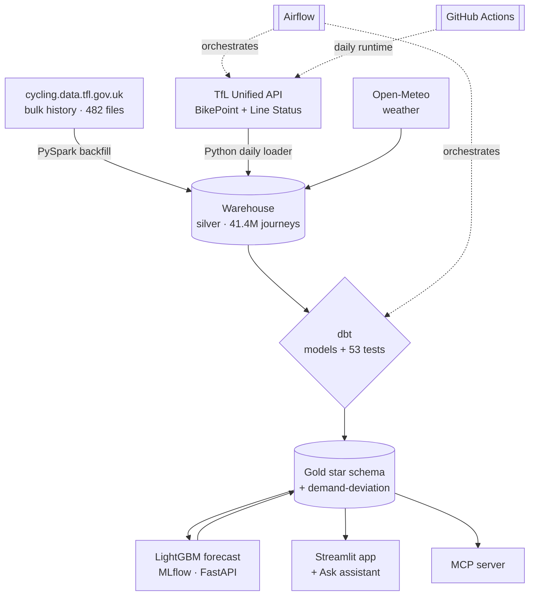
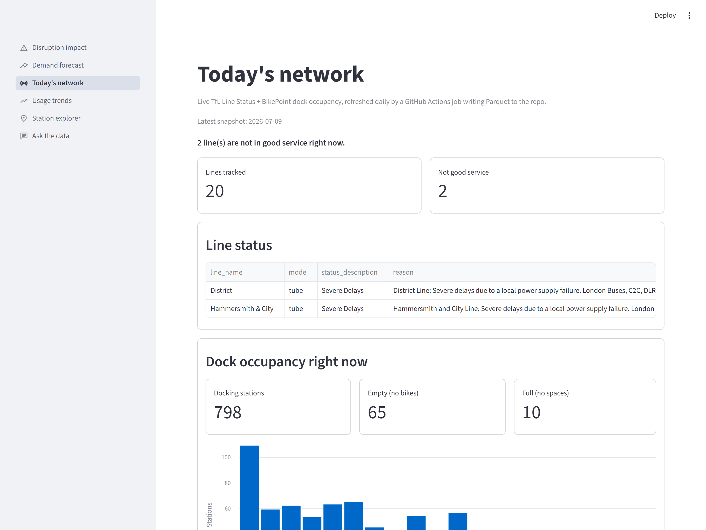

# London Cycle-Hire Analytics Platform

A living data platform over the public **Santander Cycle Hire** archive that answers one
question well: **when London's transport is disrupted, how much extra demand lands on the bikes,
and where?** It pairs a Spark-scale historical backfill with a free, always-running live layer, a
learned demand forecast, and an in-app assistant — the whole thing hosted on free tiers with no
warehouse to keep alive.

[](https://github.com/rosscyking1115/tfl-data-engineering/actions/workflows/ci.yml)
[](LICENSE)
[](https://tfl-data-engineering.streamlit.app/)

**[▶ Live demo](https://tfl-data-engineering.streamlit.app/)** · [Engineering notes](docs/) · [Architecture](#architecture)

> One of three UK open-data builds on my profile — siblings
> [uk-housing-decision-support](https://github.com/rosscyking1115/uk-housing-decision-support)
> (analytics engineering: Dagster, 197 dbt tests, published dbt docs) and
> [community-energy-flex](https://github.com/rosscyking1115/community-energy-flex) (a decision
> system with LP/MILP optimisation and a forecast-vs-actual retro). Full project map →
> [profile](https://github.com/rosscyking1115).



> [!NOTE]
> The live demo is on Streamlit's free tier and may take ~30s to wake on the first visit.
> Journey data is published in bulk with a ~1–2 month lag, so the workflow deliberately
> separates **historical quantification** from **live monitoring** — it never claims real-time
> trip prediction ([ADR-0006](docs/adr/ADR-0006-pivot-to-live-disruption-workflow.md)).

## Overview

Transport for London publishes every cycle-hire journey since 2012 — roughly **189M trips across
482 files**, with schemas that drift wildly between years. This project unifies that raw archive
into a clean, tested analytical layer, then builds three things on top:

- **A disruption analysis** — a weather-adjusted baseline that isolates how tube/rail strikes
  reshape cycling demand, per station and per day.
- **A learned forecast** — a LightGBM model that predicts station-level demand and sharpens the
  "normal" baseline the disruption effect is measured against.
- **A live, durable runtime** — a daily GitHub Actions job that refreshes line status and dock
  occupancy into committed Parquet, so the app keeps running with no warehouse and no server.

The headline result: full-network strike days drive up to **~2.3× normal cycling demand**
(median **1.42×** across 13 source-cited events) — measured against a weather-adjusted baseline,
so ordinary weather is never mistaken for the strike.

## Highlights

- **Real scale, real mess.** A PySpark backfill unifies **41.4M journeys (2022–2026)** across five
  distinct file schemas — columns renamed, dropped and re-ordered between eras — with per-file
  reconciliation proving no rows are silently lost
  ([captured warehouse evidence](docs/snowflake_evidence.md)).
- **The right tool for each job.** Spark for the multi-era backfill; plain Python for the
  kilobyte-sized daily API pulls. Both rationales are documented — see
  [the Spark ↔ Python boundary](#the-sparkpython-boundary).
- **Disruption intelligence.** A weather-adjusted baseline isolates the strike effect: disruption
  days run **1.42× median** cycling demand vs normal, with per-station drill-down — every
  event date source-cited.
- **A learned forecast, not just a median.** A LightGBM model predicts station-level daily demand
  and — by predicting with the disruption flag off — supplies a counterfactual "normal" baseline
  that's ~30% tighter than the median it replaces (**~21% lower error** on held-out 2026), tracked
  in MLflow ([ADR-0008](docs/adr/ADR-0008-ml-demand-forecast.md)).
- **Ask it in English — free for everyone.** An "Ask the data" page with instant **Quick answers**
  (no API key, every figure exact — including a live "why is this line disrupted now?") plus an
  optional bring-your-own-key Claude chat over curated, read-only tools
  ([ADR-0007](docs/adr/ADR-0007-qa-assistant-tool-calling.md)).
- **Live & durable, for free.** A daily GitHub Actions job refreshes live line status + dock
  occupancy into committed Parquet; the app reads it via DuckDB with no warehouse — so it keeps
  running long after the Snowflake trial ends.
- **Tested, dimensional model.** A dbt star schema (`fact_journey`, `dim_station`, `dim_date`) with
  **53 data tests**, including cross-era station-identity conforming.

## Screens

| Demand forecast | Ask the data |
|---|---|
|  |  |

The **Demand forecast** page shows predicted vs actual with the lift over the median baseline; the
**Ask the data** page answers plain-English questions with no key required.

## Architecture



Medallion layers: **bronze** (files/JSON as landed) → **silver** (typed, deduped, era-unified) →
**gold** (tested star schema + analytical models + the model baseline).

## The Spark/Python boundary

The most deliberate decision in the project. **Spark is justified** for the backfill: ~189M rows
across 482 files with five incompatible schemas is genuinely awkward on a single machine, and
Spark's positional CSV reader would silently corrupt the re-ordered columns without per-variant,
by-name projection. **Spark would be theatre** for the daily increment: a day of BikePoint + Line
Status JSON is a few hundred rows, handled by ~150 lines of `requests` + `executemany`. The same
reasoning that *requires* Spark for one job *forbids* it for the other. See
[ADR-0002](docs/adr/ADR-0002-spark-in-docker-and-header-variants.md).

## Machine learning

A LightGBM model ([`ml/`](ml/)) learns daily station-level departures from calendar, weather,
disruption and recent-demand lag features, and serves two purposes at once:

- **A sharper baseline.** Predicting with the disruption flag off yields a counterfactual "normal
  demand" that replaces the coarse median in the deviation analysis (`demand_deviation_ml`).
- **A validated forecast.** Trained with strict temporal validation (fit 2022→24, held-out 2026),
  it cuts error **~21% vs the median** and **~28% vs a seasonal-naive** baseline; runs are tracked
  in MLflow and it's served locally via FastAPI. See
  [ADR-0008](docs/adr/ADR-0008-ml-demand-forecast.md).

```bash
.venv/Scripts/pip install -r ml/requirements.txt
python ml/train.py        # LightGBM + MLflow tracking (local SQLite store)
python ml/predict.py      # -> app/gold_export/predicted_demand.parquet
uvicorn serve:app --app-dir ml --port 8000   # local /predict endpoint
```

## The assistant

The "Ask the data" page is designed for **correctness over coverage** — it never fabricates a
figure ([ADR-0007](docs/adr/ADR-0007-qa-assistant-tool-calling.md)):

- **Quick answers** — preset questions answered directly from the gold layer with **no API call**,
  so every number is exactly what the query returned (busiest stations, the strike effect, demand
  trend, and a live "why is this line disrupted now?"). Free for every visitor.
- **Ask anything** — an optional free-form Claude chat that calls the *same* curated, read-only
  tools and reports only numbers a tool produced. It runs on a **bring-your-own-key** basis, so the
  owner's Anthropic credits are never spent by anonymous visitors.

A separate read-only **MCP server** ([`mcp/`](mcp/)) exposes the same gold layer to AI clients
through typed, guardrailed tools — reading the committed Parquet via DuckDB, so it needs no
warehouse or credentials ([ADR-0004](docs/adr/ADR-0004-mcp-readonly-boundary.md)).

## Tech stack

| Layer | Tool |
|---|---|
| Batch processing | PySpark (Dockerised) |
| Warehouse | Snowflake (build) → DuckDB + Parquet (durable, free) |
| Transformation & tests | dbt |
| Machine learning | LightGBM · MLflow · scikit-learn · FastAPI |
| Orchestration | Airflow · GitHub Actions |
| App & AI access | Streamlit · Anthropic SDK · Model Context Protocol |
| Enrichment | TfL Unified API · Open-Meteo |

## Quickstart

```bash
python -m venv .venv
.venv/Scripts/pip install -r app/requirements.txt   # demo app deps
streamlit run app/streamlit_app.py                   # runs on committed Parquet, no warehouse
```

The demo app reads committed Parquet via DuckDB — it needs no database and runs fully offline. The
Quick answers work with no setup; the free-form chat needs your own `ANTHROPIC_API_KEY` (in `.env`
locally). To reproduce the warehouse build (Spark → Snowflake → dbt), see [docs/](docs/).

## Project structure

```
ingestion/   API loaders, warehouse loaders, data-export scripts
spark/       multi-era backfill job
dbt/         staging + marts models, tests, seeds
ml/          demand model — features, LightGBM training (MLflow), batch predict, FastAPI serving
app/         Streamlit app (DuckDB over committed gold Parquet) + Ask assistant
mcp/         read-only MCP server over the gold layer
infra/       Airflow (Docker Compose), run scripts
tests/       pytest suite (feature-leakage guard, Quick answers, tool dispatch) — run in CI
docs/        ADRs, architecture and engineering notes
```

## How it stays live

A daily GitHub Actions job ([.github/workflows/daily.yml](.github/workflows/daily.yml)) ingests
live line status and dock occupancy into committed Parquet; `dbt-duckdb` refreshes the
weather-adjusted baseline and the demand-deviation tables; the Streamlit app reads it all via
DuckDB. No warehouse, no server — it runs on free tiers indefinitely. A second scheduled job
([.github/workflows/keepalive.yml](.github/workflows/keepalive.yml)) pings the app every few hours
so free-tier sleep rarely greets a visitor with a cold start — a pragmatic mitigation of the
free tier, not a Streamlit limit.



## Engineering notes

- [ADR-0001](docs/adr/ADR-0001-dataset-and-stack.md) — dataset selection, with measured evidence
- [ADR-0002](docs/adr/ADR-0002-spark-in-docker-and-header-variants.md) — Spark environment & schema-drift handling
- [ADR-0003](docs/adr/ADR-0003-orchestration-and-boundary.md) — orchestration sizing & the incremental boundary
- [ADR-0004](docs/adr/ADR-0004-mcp-readonly-boundary.md) — MCP read-only guardrails
- [ADR-0005](docs/adr/ADR-0005-streamlit-demo-layer.md) — the demo layer & durable hosting
- [ADR-0006](docs/adr/ADR-0006-pivot-to-live-disruption-workflow.md) — pivot to the live disruption workflow & the journey-lag honesty split
- [ADR-0007](docs/adr/ADR-0007-qa-assistant-tool-calling.md) — QA assistant: curated tool-calling over text-to-SQL, plus the public/BYOK design
- [ADR-0008](docs/adr/ADR-0008-ml-demand-forecast.md) — learned demand baseline: LightGBM as a counterfactual, temporally validated
- [Snowflake evidence](docs/snowflake_evidence.md) — warehouse-side facts (41.4M silver rows, gold sizes, ~1 credit cost) captured before the trial expired

## Roadmap

- **Power BI (PL-300):** a code-first semantic model over the same durable Parquet lives in
  [`powerbi/`](powerbi/) — DAX measures, Power Query M, and a TMDL model — ready to assemble into a
  report in Power BI Desktop.
- Accumulate forward dock-occupancy history to unlock short-horizon availability nowcasting
  (not possible today — TfL publishes no historical occupancy).
- Extend the forecast to an hourly grain (needs a pre-trial Snowflake re-export of hourly flows).
- Optional always-on hosting (a small paid host) to remove free-tier cold starts entirely.
