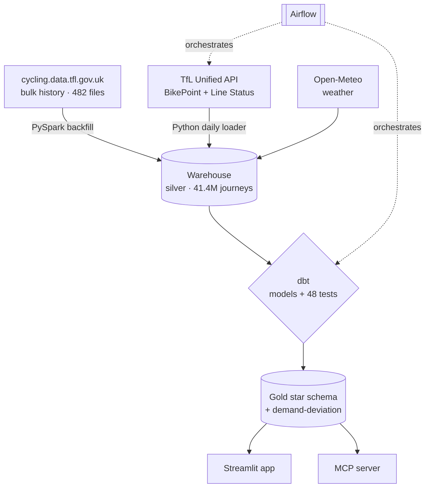

# London Cycle-Hire Analytics Platform

End-to-end data platform over the public **Santander Cycle Hire** archive: a decade of
messy, multi-format journey files unified into a tested warehouse model and served through
an interactive app — with a flagship analysis of **how transport disruptions reshape
cycling demand** across London.

**[▶ Live demo](https://tfl-data-engineering.streamlit.app/)** · [Engineering notes](docs/) · [Architecture](#architecture)

## Overview

Transport for London publishes every cycle-hire journey since 2012 — roughly **189M trips
across 482 files**, with formats and schemas that drift wildly between years. This project
turns that raw archive into a clean, queryable, tested analytical layer, then puts a live
dashboard on top.

The headline question it answers: **when the Tube is disrupted, how much extra demand lands
on the cycle network, and where?** Strike days in the data drive **1.2×–2.6× normal cycling
demand** — an effect this platform quantifies per station against a weather-adjusted baseline.

## Highlights

- **Real scale, real mess.** A PySpark backfill unifies **41.4M journeys (2022–2026)** across
  five distinct file schemas — columns renamed, dropped, and re-ordered between eras — with
  per-file reconciliation proving no rows are silently lost.
- **The right tool for each job.** Spark for the multi-era backfill; plain Python for the
  kilobyte-sized daily API pulls. Both rationales are documented — see
  [the Spark ↔ Python boundary](#the-sparkpython-boundary).
- **Tested, dimensional model.** A dbt star schema (`fact_journey`, `dim_station`, `dim_date`)
  with **48 data tests**, including cross-era station-identity conforming.
- **Orchestrated & observable.** Airflow DAGs for daily ingestion, model builds, and a
  demonstrated failure-alerting path.
- **Disruption intelligence.** A weather-adjusted baseline isolates the strike effect:
  disruption days run **1.33× median** cycling demand vs normal, with per-station drill-down.
- **A learned forecast, not just a median.** A LightGBM model predicts station-level daily
  demand and — by predicting with the disruption flag off — supplies a **counterfactual "normal"
  baseline** that's ~30% tighter than the median it replaces. Temporally validated: **~21% lower
  error** than the median and **~28%** than a seasonal-naive on held-out 2026, tracked in MLflow
  ([ADR-0008](docs/adr/ADR-0008-ml-demand-forecast.md)).
- **Live & durable, for free.** A daily GitHub Actions job refreshes live Line Status +
  dock occupancy into committed Parquet; the app reads it via DuckDB with no warehouse — so
  it keeps running long after the Snowflake trial ends.
- **Ask it in English.** An "Ask the data" page with two tiers: free **Quick answers** (preset
  questions answered with no API — every figure exact, including a live "why is this line
  disrupted now?"), plus an optional **bring-your-own-key** Claude chat that calls curated,
  read-only tools and reports only numbers a tool returned rather than fabricate
  ([ADR-0007](docs/adr/ADR-0007-qa-assistant-tool-calling.md)).
- **Interactive & AI-queryable.** A Streamlit app (ask · disruption impact · demand forecast ·
  today's network · usage trends · station explorer), plus a read-only MCP server exposing the
  warehouse to AI clients through typed, guardrailed tools.
- **Frugal by design.** The entire warehouse build cost **~$1** on an XS warehouse with
  aggressive auto-suspend.

## Architecture



Medallion layers: **bronze** (files/JSON as landed) → **silver** (typed, deduped, era-unified)
→ **gold** (tested star schema + analytical models).

## The Spark/Python boundary

The most deliberate decision in the project. **Spark is justified** for the backfill: ~189M
rows across 482 files with five incompatible schemas is genuinely awkward on a single machine,
and Spark's positional CSV reader would silently corrupt the re-ordered columns without
per-variant, by-name projection. **Spark would be theatre** for the daily increment: a day of
BikePoint + Line Status JSON is a few hundred rows, handled by ~150 lines of `requests` +
`executemany`. The same reasoning that *requires* Spark for one job *forbids* it for the other.
See [ADR-0002](docs/adr/ADR-0002-spark-in-docker-and-header-variants.md).

## Tech stack

| Layer | Tool |
|---|---|
| Batch processing | PySpark (Dockerised) |
| Warehouse | Snowflake (build) → DuckDB + Parquet (durable, free) |
| Transformation & tests | dbt |
| Machine learning | LightGBM · MLflow · scikit-learn · FastAPI |
| Orchestration | Airflow · GitHub Actions |
| App & AI access | Streamlit · Model Context Protocol |
| Enrichment | TfL Unified API · Open-Meteo |

## Quickstart

```bash
python -m venv .venv
.venv/Scripts/pip install -r app/requirements.txt      # demo app deps
streamlit run app/streamlit_app.py                      # runs on committed Parquet, no warehouse needed
```

The demo app reads committed Parquet via DuckDB — it needs no database and runs fully offline.
To reproduce the warehouse build (Spark → Snowflake → dbt), see [docs/](docs/).

## Project structure

```
ingestion/   API loaders, warehouse loaders, data-export scripts
spark/       multi-era backfill job
dbt/         staging + marts models, tests, seeds
ml/          demand model — features, LightGBM training (MLflow), batch predict, FastAPI serving
app/         Streamlit app (DuckDB over committed gold Parquet)
mcp/         read-only MCP server over the gold layer
infra/       Airflow (Docker Compose), run scripts
docs/        ADRs, architecture and engineering notes
```

## Engineering notes

- [ADR-0001](docs/adr/ADR-0001-dataset-and-stack.md) — dataset selection, with measured evidence
- [ADR-0002](docs/adr/ADR-0002-spark-in-docker-and-header-variants.md) — Spark environment & schema-drift handling
- [ADR-0003](docs/adr/ADR-0003-orchestration-and-boundary.md) — orchestration sizing & the incremental boundary
- [ADR-0004](docs/adr/ADR-0004-mcp-readonly-boundary.md) — MCP read-only guardrails
- [ADR-0005](docs/adr/ADR-0005-streamlit-demo-layer.md) — the demo layer & durable hosting
- [ADR-0006](docs/adr/ADR-0006-pivot-to-live-disruption-workflow.md) — pivot to the live disruption workflow & the journey-lag honesty split
- [ADR-0007](docs/adr/ADR-0007-qa-assistant-tool-calling.md) — QA assistant: curated tool-calling over text-to-SQL
- [ADR-0008](docs/adr/ADR-0008-ml-demand-forecast.md) — learned demand baseline: LightGBM as a counterfactual, temporally validated

## How it stays live

A daily GitHub Actions job ([.github/workflows/daily.yml](.github/workflows/daily.yml))
ingests live Line Status and dock occupancy into committed Parquet; `dbt-duckdb` refreshes the
weather-adjusted baseline and the demand-deviation table; the Streamlit app reads it all via
DuckDB. No warehouse, no server — it runs on free tiers indefinitely. Because journey data is
published in bulk with a lag, the design honestly separates **historical quantification** from
**live monitoring** rather than claiming real-time trip prediction ([ADR-0006](docs/adr/ADR-0006-pivot-to-live-disruption-workflow.md)).

A second scheduled job ([.github/workflows/keepalive.yml](.github/workflows/keepalive.yml))
pings the app every few hours so free-tier sleep rarely greets a visitor with a cold start. That's
a pragmatic mitigation of the Community Cloud free tier, not a Streamlit limit — a truly always-on
deploy is a small paid host away.

## Machine learning

A LightGBM model ([`ml/`](ml/)) learns daily station-level departures from calendar, weather,
disruption and recent-demand lag features. It serves two purposes at once:

- **A sharper baseline.** Predicting with the disruption flag off yields a counterfactual "normal
  demand" that replaces the coarse median in the deviation analysis (`demand_deviation_ml`).
- **A validated forecast.** Trained with strict temporal validation (fit 2022→24, held-out 2026),
  it cuts error **~21% vs the median** and **~28% vs a seasonal-naive** baseline; runs are tracked
  in MLflow and it's served locally via FastAPI (`ml/serve.py`, `+ Dockerfile`). See
  [ADR-0008](docs/adr/ADR-0008-ml-demand-forecast.md).

```bash
.venv/Scripts/pip install -r ml/requirements.txt
python ml/train.py        # LightGBM + MLflow tracking (local SQLite store)
python ml/predict.py      # → app/gold_export/predicted_demand.parquet
uvicorn serve:app --app-dir ml --port 8000   # local /predict endpoint
```

## Roadmap

- Accumulate forward dock-occupancy history to unlock short-horizon availability nowcasting
  (not possible today — TfL publishes no historical occupancy).
- Extend the forecast to an hourly grain (needs a pre-trial Snowflake re-export of hourly flows).
