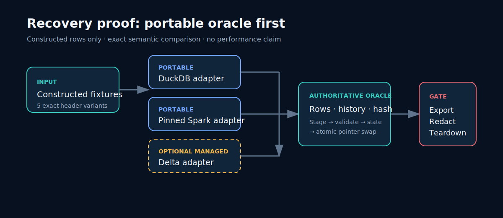
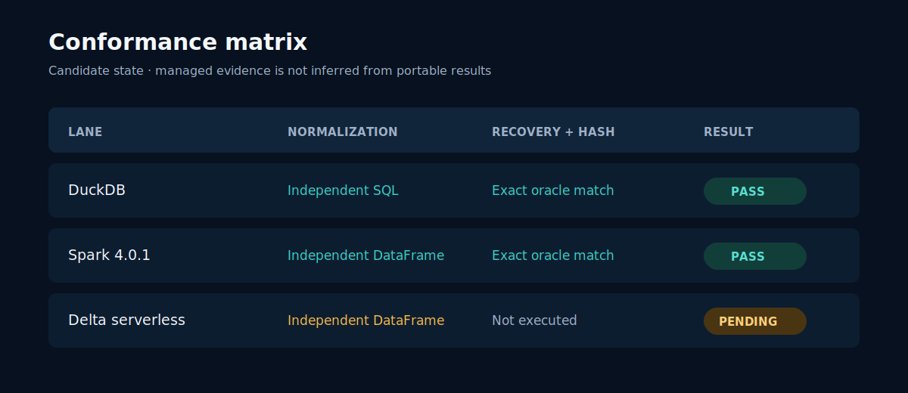

# T3 managed-proof candidate

This directory is the redacted evidence boundary for the optional `0.3.0` candidate. The portable
DuckDB/Spark suite at `0.2.0` remains authoritative and releasable independently.

Current gate: **NARROW — managed execution unavailable**. Three bounded Free Edition serverless
job invocations across the initial and one allowed corrective deployment failed before scenario
code started because the task runner could not reliably read workspace Python files. There were
zero complete managed attempts: the semantic oracle was never reached and no DuckDB-versus-Delta
comparison exists. The redacted [managed report](managed-proof.json) records the terminal decision.

The temporary schema contained zero tables. The targeted cleanup task was attempted but encountered
a separate script-wrapper context error; bundle destruction then removed the managed volume, schema,
both jobs, and workspace files. Independent checks confirmed every scoped resource was absent.

## Release decision

- `PASS`: `0.3.0` may be proposed after independent review and owner approval.
- `NARROW` or `FAIL`: retain diagnostics, keep this candidate unreleased, and release `0.2.0`
  against the frozen T2 commit. **This is the selected path.**
- `STOP`: block every release until cleanup and secret handling are resolved.

See the [claim ledger](claim-ledger.json), [managed report](managed-proof.json), and
[prepared portfolio copy](portfolio-copy.md). None of the portfolio copy is published by T3.

